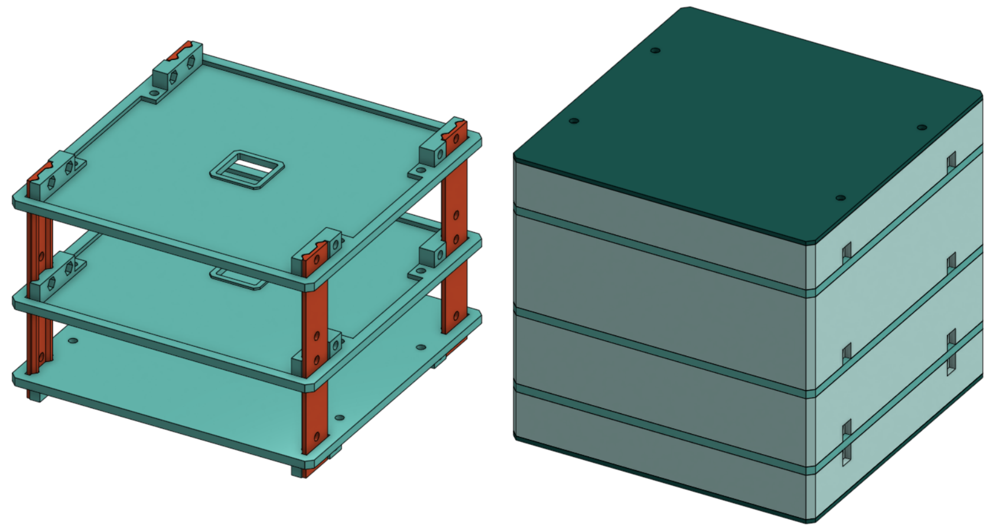

# simpleR

A mechanical robotic framework designed for research, education, and fun.

The core concept of the framework is the **platform**. A platform is a flat platform that can support mechanics and electronics. These platforms are connected by vertical bars <!-- and can be covered shells -->. Below is the complete list of base parts:

- **Platform**: Interchangeable square-shaped plate that can support mechanics and electronics.
- **Bar**: Vertical structural element that connects the platforms (3 variants). You need 4 bars per project.
<!-- - **Shell**: Cover with a closed or open top. (3 variants) -->

All parts are designed for easy modification, extension, 3D printing, and assembly.

The framework includes both empty platforms and **prototypes** build on empty platforms. Prototypes are pre-assembled platforms that come with some mechanics and electronics already installed. This feature provides users with a starting point to build upon.

## Base Framework Parts

| Part (link)  | Image |
| --- | --- |
| [Platform](framework-base\platform.step)|  |
| [Bar - 1 Platform (left)](framework-base\bar-1p_left.step) |  |
| [Bar - 1 Platform (right)](framework-base\bar-1p_right.step) |  |
| [Bar - 2 Platforms](framework-base\bar-2p.step) |  |
| [Bar - 3 Platforms](framework-base\bar-3p.step) |  |
