# simpleR

- [simpleR](#simpler)
    - [Getting Started](#getting-started)
    - [Base Framework Parts](#base-framework-parts)
    - [Features](#features)
        - [Small Range of Parts](#small-range-of-parts)
        - [Scalable](#scalable)
        - [Flexible](#flexible)
        - [Easily Printable](#easily-printable)
        - [Rigid](#rigid)
        - [Modifiable](#modifiable)
        - [Nuts as Inserts](#nuts-as-inserts)
        - [Modular](#modular)
    - [Prototypes](#prototypes)
    - [Example Projects](#example-projects)
    - [Branding](#branding)
    - [License](#license)

A mechanical robotic framework designed for research, education, and fun.

The core concept of the framework is the **platform**. A platform is a flat plate that can support mechanics and electronics. These platforms are connected by vertical bars and can be covered with shells. Below is the complete list of base parts:

- **Platform**: Interchangeable square-shaped plate that can support mechanics and electronics.
- **Bar**: Vertical structural element that connects the platforms: 3 variants. The variants have different lengths designed to be used with differenet amount of platforms - from 1 to 3. You need 4 bars per project.
- **Shell**: Platform walls with open top. (3 variants)
- **Lid**: Cover for shells.

All parts are designed for easy modification, extension, 3D printing, and assembly.

The framework includes both base platforms and **prototypes** build on using base platforms. The prototypes are more specialized parts that can be used for specific custom assemblies:

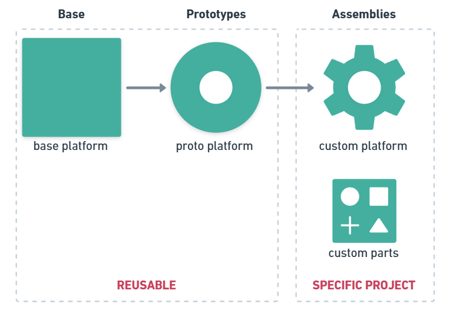

## Getting Started

1. Download the parts from the [framework-base](framework-base) and [framework-prototypes](framework-prototypes) folders.
2. Open the parts in your favorite CAD software.
3. Modify the parts to fit your needs.
4. Print the parts using your 3D printer.
5. Assemble the parts using M3 nuts and bolts.
6. Share your project and prototypes with the community!
7. Have fun!

## Base Framework Parts

| Part (link)  | Image |
| --- | --- |
| [Platform](framework-base/platform.step)| 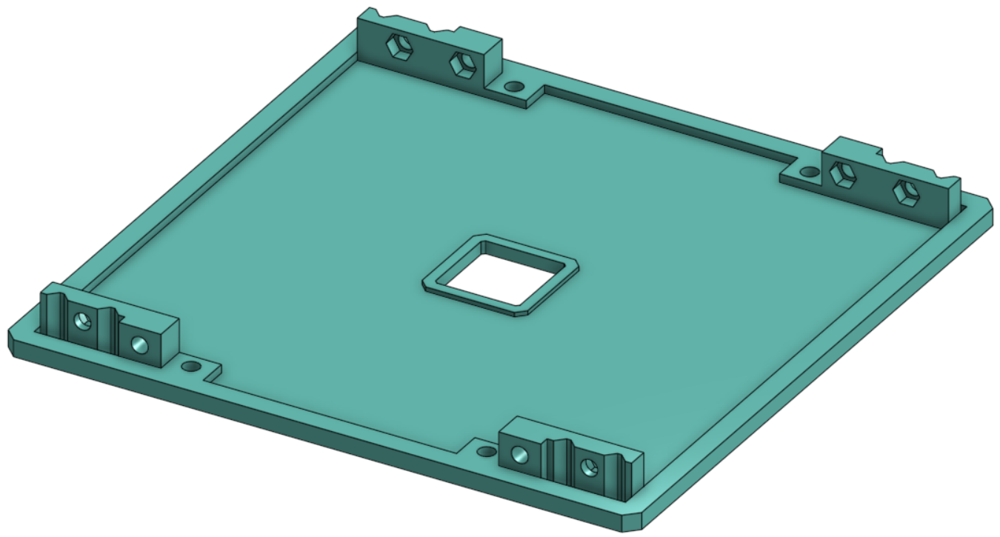 |
| [Bar - 1 Platform (left)](framework-base/bar-1p_left.step) | 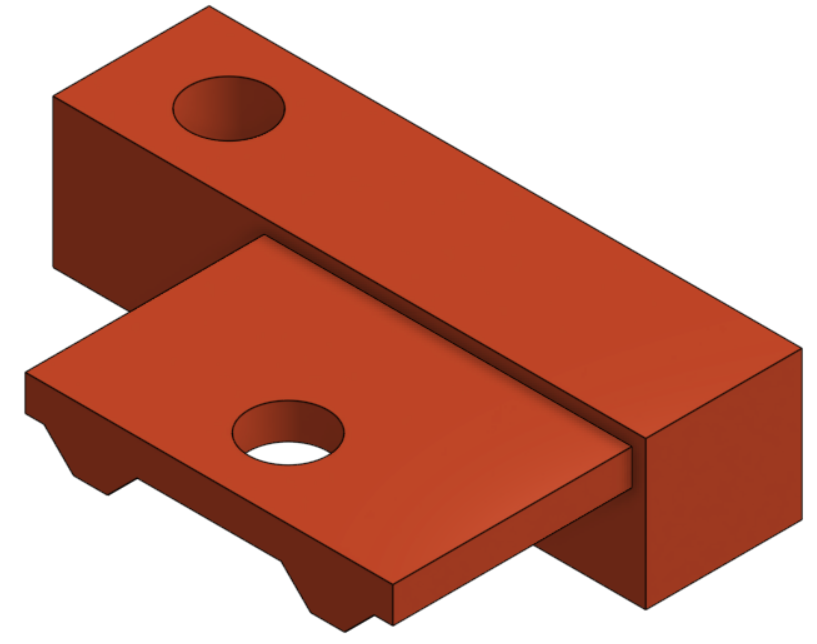 |
| [Bar - 1 Platform (right)](framework-base/bar-1p_right.step) | 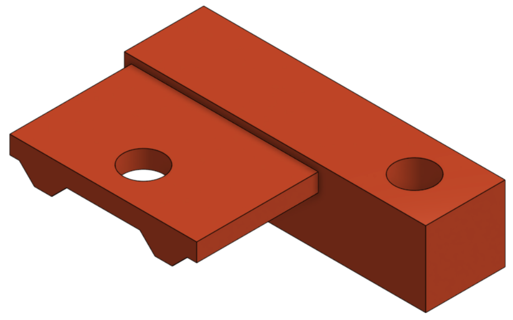 |
| [Bar - 2 Platforms](framework-base/bar-2p.step) | 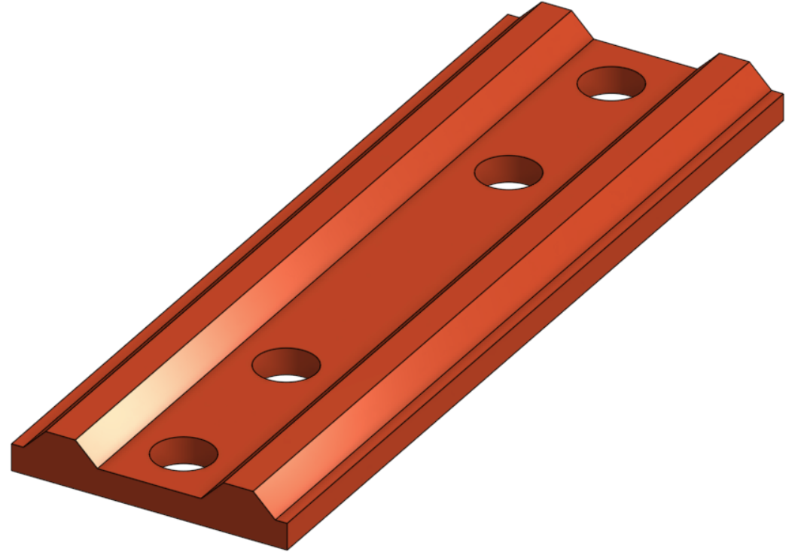 |
| [Bar - 3 Platforms](framework-base/bar-3p.step) | 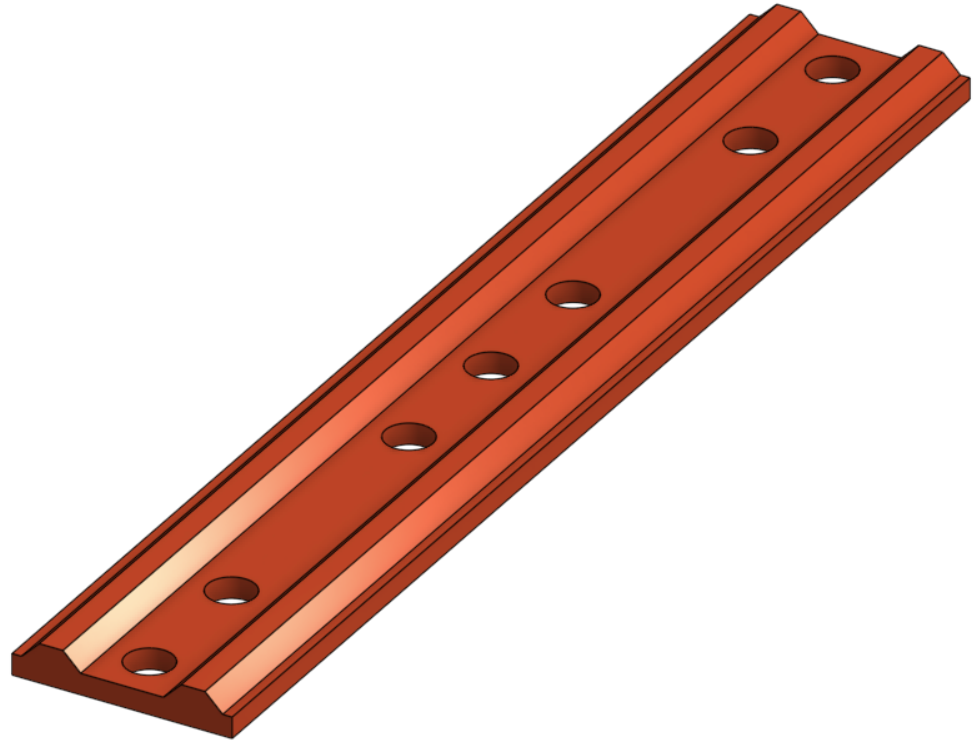 |
| [Shell - 22 mm](framework-base/shell-22.step) | 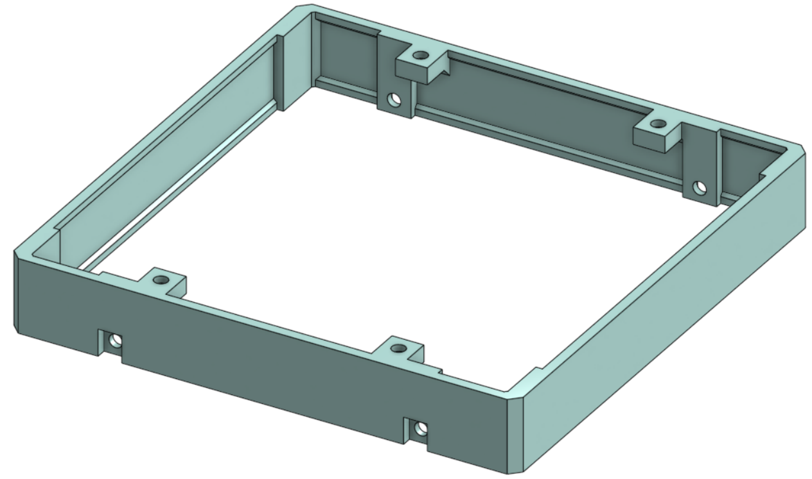 |
| [Shell - 34 mm](framework-base/shell-34.step) | 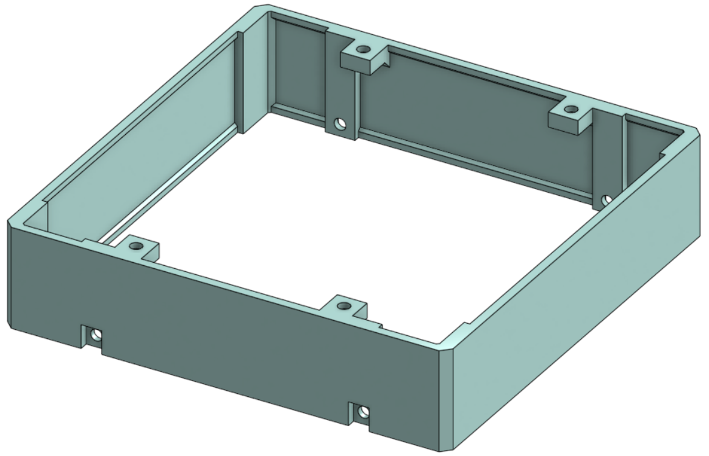 |
| [Shell - 46 mm](framework-base/shell-46.step) | 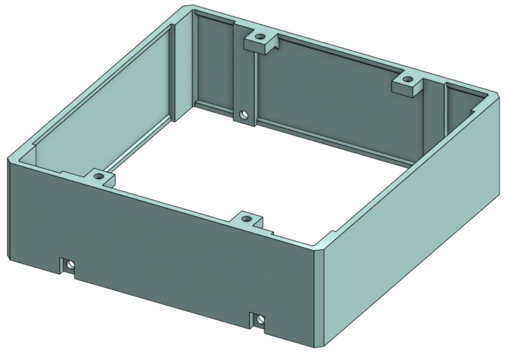 |
| [Lid](framework-base/lid.step) | 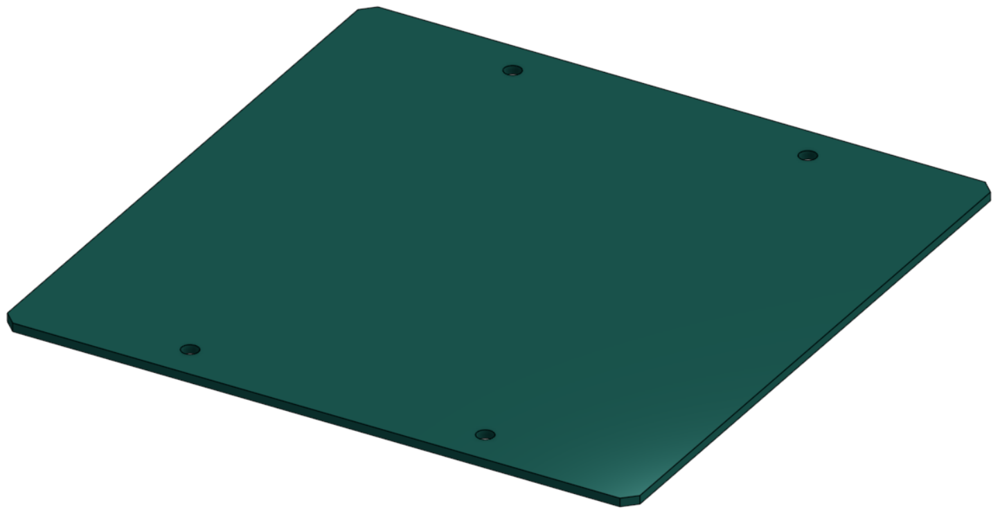 |

## Features

### Small Range of Parts

The framework is based on a small range of parts that can be easily combined to create a wide range of projects.

See: [Base Framework Parts](#base-framework-parts)

### Scalable

Choose the project of the size you need, and extend it in the future.

|     |     |     |
| --- | --- | --- |
|  |  |  |

### Flexible

Adjust the project to your needs. Add or remove platforms, choose the right volume for your components.

|     |     |
| --- | --- |
|  |  |

### Easily Printable

All parts are designed for easy 3D printing. No supports are needed.

|     |     |     |
| --- | --- | --- |
|  |  |  |

### Rigid

The special shape of the bars makes the structure stable and rigid in all directions. The shells provide additional structural support.

### Modifiable

All parts are designed for easy modification. They are shipped in STEP format, which can be opened in any CAD software.

|     |     |     |
| --- | --- | --- |
|  | ➡️ |  |

|     |     |     |
| --- | --- | --- |
|  | ➡️ |  |

### Nuts as Inserts

The nuts are an accessible and reliable alternative to metal inserts, providing a strong and reusable connection between the parts.

|     |     |
| --- | --- |
|  |  |

### Modular

All the parts are made in the way so you don't have to re-print large volumes of plastic when you want to make a small change. Reprint only necessary parts.

|     |     |     |
| --- | --- | --- |
|  |  |  |

## Prototypes

Prototypes are parts made on top of the base framework parts. They have some particular application in mind.

| Prototype (link) |  Application Recommendation | Image |
| ---              | ---      | ---   |
| [prototype-wheels-v2](framework-prototypes/prototype-wheels-v2/prototype-wheels-v2.step) | A rigid platform for two motorized wheels | 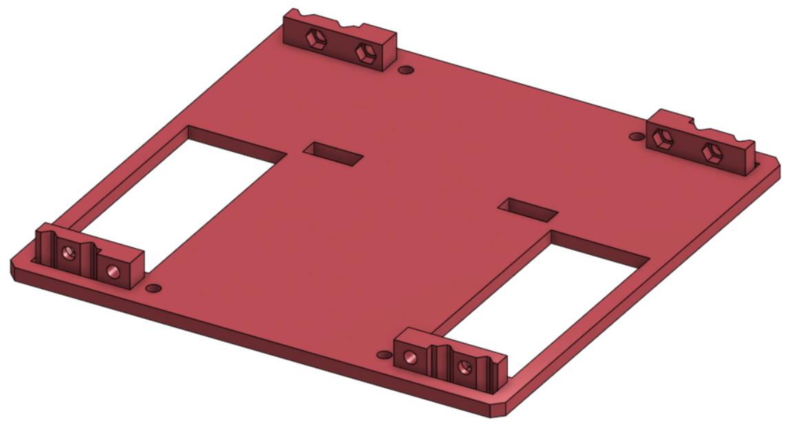 |

## Example Projects

TBD

## Branding

The framework tries to keep the branding simple and consistent. The recommended colors are:

- Platforms:  `#57C6BD`
- Bars:  `#DD5228`
- Shells:  `#BCEFEA`
- Lids:  `#18948B`
- Prototypes:  `#DA5B5F`

## License

This project is licensed under the MIT License - see the [LICENSE](LICENSE) file for details.
